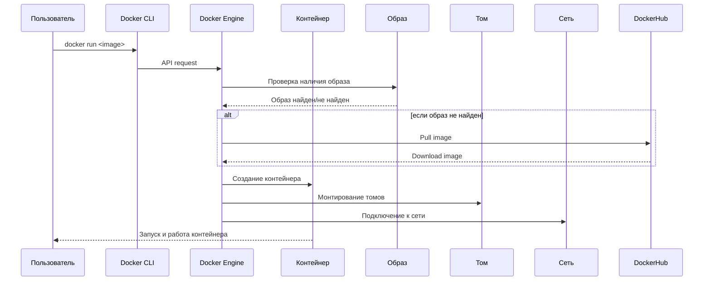
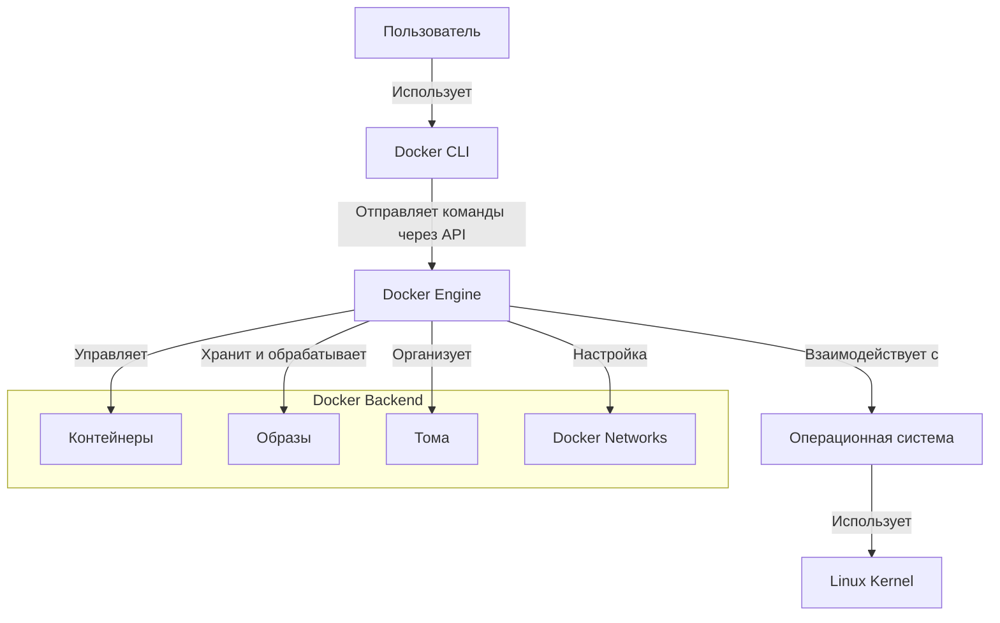

# Что такое Docker

## Зачем нужен Docker на примере финтеха

Docker — это платформа с открытым исходным кодом, которая используется для автоматизации разработки, доставки и развертывания приложений. Docker помогает решать следующие задачи:

1. **Изолированность среды выполнения**: Банковские системы работают с критически важными данными, поэтому любые изменения в программном обеспечении могут привести к непредсказуемым последствиям. Docker позволяет запускать приложения в изолированных контейнерах, что минимизирует риски конфликтов между зависимостями и упрощает тестирование новых версий .

2. **Быстрое развертывание**: Финтех-приложения часто требуют быстрого обновления функционала. Docker позволяет быстро создавать и разворачивать новые версии приложений без необходимости переустановки или настройки операционной системы. Это особенно важно для банков, где время реакции на запросы клиентов или изменения законодательства играет основную роль.

3. **Масштабируемость**: Docker позволяет легко масштабировать приложения. Например, если банк запускает новую акцию по кредитам и нагрузка на сервер увеличивается, можно быстро добавить дополнительные контейнеры для обработки запросов.

---

### Из чего состоит Docker

Docker состоит из основных компонентов:

1. **Контейнеры**: Легковесные изолированные среды выполнения, которые содержат все необходимое для работы приложения: код, библиотеки, зависимости и конфигурации.
2. **Образы (Images)**: Шаблоны, на основе которых создаются контейнеры. Образы создаются с помощью Dockerfile.
3. **Docker Engine/Docker Daemon**: Сервис, который управляет контейнерами.
4. **Docker CLI**: Интерфейс командной строки для взаимодействия с Docker.
5. **Сетевая часть**: Docker предоставляет инструменты для организации сетевого взаимодействия между контейнерами.
6. **Хранилище (Storage)**: Docker поддерживает различные механизмы хранения данных, такие как volumes и bind mounts.
7. **Docker Swarm**: это встроенная система оркестрации контейнеров Docker.

---

### Зачем нужен Docker Compose

Docker Compose — это инструмент, предназначенный для определения и запуска многоконтейнерных приложений. Он особенно полезен в следующих случаях:

1. **Управление сложными приложениями**: В банковских системах часто используются микросервисы, где каждая часть приложения работает в отдельном контейнере. Docker Compose позволяет описать взаимодействие этих контейнеров, правила их запуска и работы, что упрощает развертывание и тестирование.

2. **Описание зависимостей**: Например, банковское приложение может использовать базу данных PostgreSQL, кэширование через Redis и веб-сервер Nginx. Docker Compose позволяет описать все эти зависимости в одном файле `docker-compose.yml` и запустить их одной командой.

3. **Унифицированное окружение**: Docker Compose гарантирует, что разработчики, тестировщики и DevOps-инженеры работают в одинаковых средах, что снижает количество ошибок, связанных с различиями в конфигурациях.

---

### Зачем нужен Dockerfile

Dockerfile — это текстовый файл, содержащий инструкции для создания Docker-образа. Он используется для:

1. **Автоматизации сборки образов**: Dockerfile позволяет описать шаги для создания образа, включая установку зависимостей, копирование файлов и настройку среды выполнения.

2. **Повторяемость**: Dockerfile делает процесс создания образов повторяемым. Например, если банк разрабатывает новую версию приложения, он может использовать тот же Dockerfile для создания нового образа с обновленным кодом.

3. **Стандартизация**: Dockerfile упрощает стандартизацию процесса разработки и развертывания, что особенно важно для финтех-компаний, где требования к безопасности и стабильности высоки.

---

### Из чего состоит Docker: сетевая часть, архитектурная часть, Docker C Run и RunC, Docker Engine 

1. **Сетевая часть**:
   - Docker предоставляет встроенные сетевые драйверы для организации взаимодействия между контейнерами. Например, драйвер `bridge` используется для создания внутренней сети между контейнерами, а `host` позволяет контейнерам использовать сеть хост-системы.
   - Также Docker поддерживает пользовательские сети, которые можно настраивать для сложных приложений.

2. **Архитектурная часть**:
   - Docker использует клиент-серверную архитектуру. Клиент (CLI) отправляет команды на Docker Daemon, который управляет контейнерами.
   - Docker Daemon взаимодействует с низкоуровневыми компонентами, такими как containerd и runc, для запуска и управления контейнерами.

3. **Docker C Run и RunC**:
   - **RunC** — это легковесный контейнерный runtime, который отвечает за низкоуровневое создание и управление контейнерами. RunC реализует стандарт OCI (Open Container Initiative), что обеспечивает совместимость с другими контейнерными технологиями.
   - **Containerd** — это более высокоуровневый runtime, который управляет жизненным циклом контейнеров и взаимодействует с RunC. Containerd отвечает за такие задачи, как загрузка образов, управление хранилищем и мониторинг контейнеров.

4. **Зачем нужен Docker Engine**:
   - **Docker Engine** — это ядро платформы, которое отвечает за создание, запуск и управление контейнерами. Он предоставляет API для взаимодействия с контейнерами и образами, а также поддерживает работу с сетями и томами. Без Docker Engine невозможно было бы использовать контейнеры для изоляции приложений.
5. **Docker Swarm** — это встроенная система оркестрации контейнеров Docker, которая упрощает управление кластером серверов, обеспечивая автоматическое распределение, масштабирование и отказоустойчивость контейнеризированных приложений. С его помощью можно легко развертывать сервисы, балансировать нагрузку между узлами и обновлять приложения без простоя, используя простые команды Docker CLI. Благодаря своей легкости и интеграции с Docker Engine, Swarm идеально подходит для небольших и средних проектов, где важны скорость настройки и минимальная сложность.

---

### Последовательность действий при запуске Docker контейнера в схематичном виде

---

### Глобальная работа Docker, основные компоненты и их взаимодействие

---

Docker и его инструменты, такие как **Docker Compose** и **Dockerfile**, играют основную роль в современной разработке, особенно в таких областях, как финтех и банковский сектор.

Они обеспечивают изоляцию, масштабируемость, безопасность и удобство развертывания приложений.

Сетевая и архитектурная части **Docker** позволяют эффективно организовывать взаимодействие между контейнерами, а низкоуровневые компоненты, такие как **RunC**, обеспечивают надежность и производительность.
